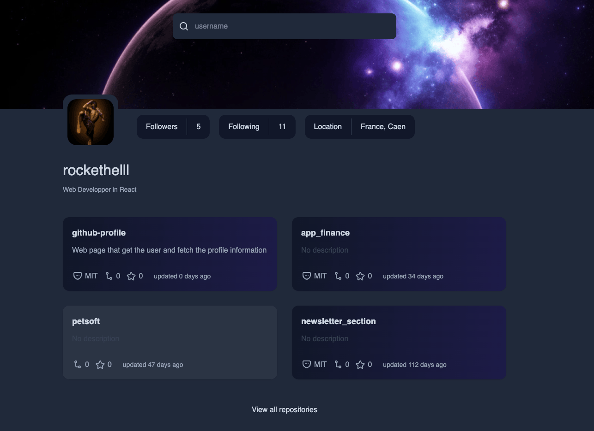

# GitHub Profile Viewer



This project is a web application that allows users to view and explore GitHub profiles. It is built using modern web technologies and follows best practices for performance and accessibility.

## Features

- Search for GitHub profiles by username.
- View detailed information about a user's profile, including repositories, followers, and more.
- Responsive design for desktop, tablet, and mobile devices.
- Optimized images for faster loading.

### Prerequisites

- [Node.js](https://nodejs.org/) (v16 or later)
- [pnpm](https://pnpm.io/) (preferred package manager)

### Installation

1. Clone the repository:

```sh
git clone git@github.com:rockethelll/github-profile.git
cd github-profile-viewer
```

2.Install dependencies:

`pnpm install`

3.Start the development server:

`pnpm dev`

4.Open the application in your browser at [http://localhost:5173](http://localhost:5173).

Build for Production
To build the project for production, run:

`pnpm build`

The output will be in the dist/ directory.

### Contributing

Contributions are welcome! Please follow these steps:

### Fork the repository

Create a new branch for your feature or bugfix.
Commit your changes and push the branch.
Open a pull request.

### License

This project is licensed under the MIT License.

### Acknowledgments

Vite for the build tool.
TypeScript for type safety.
GitHub API for profile data.

